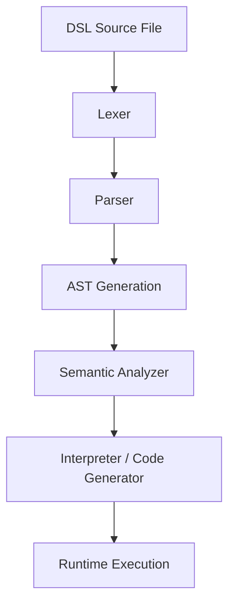
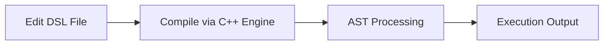

# 📘 Durin’s Code


**Durin’s Code** is a domain-specific language (DSL) and compiler system built for designing structured interactive environments, primarily for educational compiler construction (CS4031).

It includes:

* A custom DSL for defining structured worlds (rooms, items, actions, NPCs)
* A C++ compiler/interpreter pipeline
* A LaTeX-based documentation framework
* A modular CMake build system

---

## ⚙️ What the project does

Durin’s Code allows developers to define structured environments using a simple DSL and execute them via a compiler backend.

### Example DSL

```txt
room "Hall" {
    description "A long corridor with dim light"
    item "key"
    exit "north" -> "Kitchen"
}
```

---

## 🧠 System Architecture



---

## 🚀 Why this project is useful

* Demonstrates real-world **compiler design pipeline**
* Shows practical implementation of:

  * Lexical analysis
  * Parsing and AST construction
  * Semantic validation
  * Execution/runtime interpretation
* Provides a foundation for:

  * Game engines
  * DSL experimentation
  * Academic compiler projects

---

## 📦 Project Structure

```text
DurinsCode/
├── src/              # Core compiler and interpreter (C++)
├── test/             # Test + build artifacts (CMake)
├── docs/             # LaTeX documentation system
├── examples/         # Sample DSL programs
├── CMakeLists.txt    # Build configuration
```

---

## ⚙️ Getting Started

### 1. Clone the repository

```bash
git clone https://github.com/amh1k/DurinsCode.git
cd DurinsCode
```

---

### 2. Build the project

```bash
mkdir build
cd build
cmake ..
make
```

---

### 3. Run a program

```bash
./DurinsCode ../examples/sample.dc
```

---

## 📄 Documentation

The project includes a structured LaTeX documentation system:

```bash
cd docs
pdflatex main.tex
```

---

## 🛠️ Development Workflow



---

## 🤝 Contributing

1. Fork repository
2. Create feature branch
3. Commit changes
4. Open pull request

### Guidelines

* Keep compiler modular
* Avoid committing build artifacts (`build/`, `test/build`)
* Maintain consistent C++ style

---

## 👨‍💻 Maintainers

* Abdullah — Project Lead
* CS4031 Compiler Construction Team

---

## 📜 License

This project is licensed under the MIT License. See `LICENSE` for details.

---

## ⭐ Highlights

* Custom DSL design
* Full compiler pipeline implementation
* Clean modular architecture
* Academic + practical hybrid system
