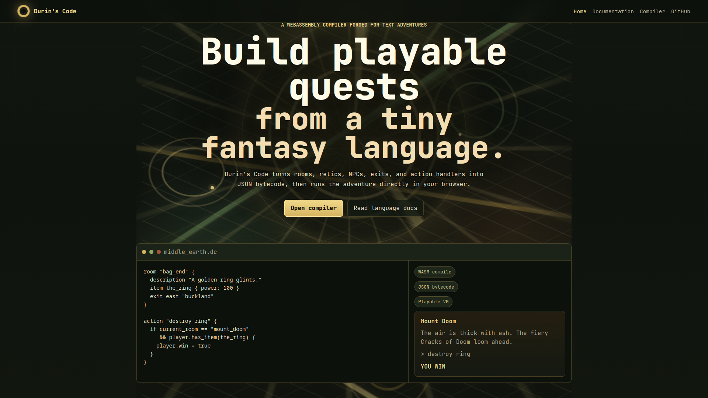
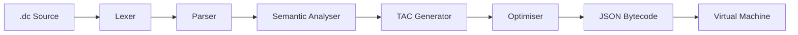
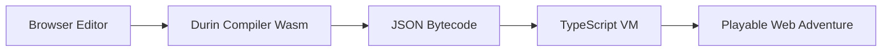
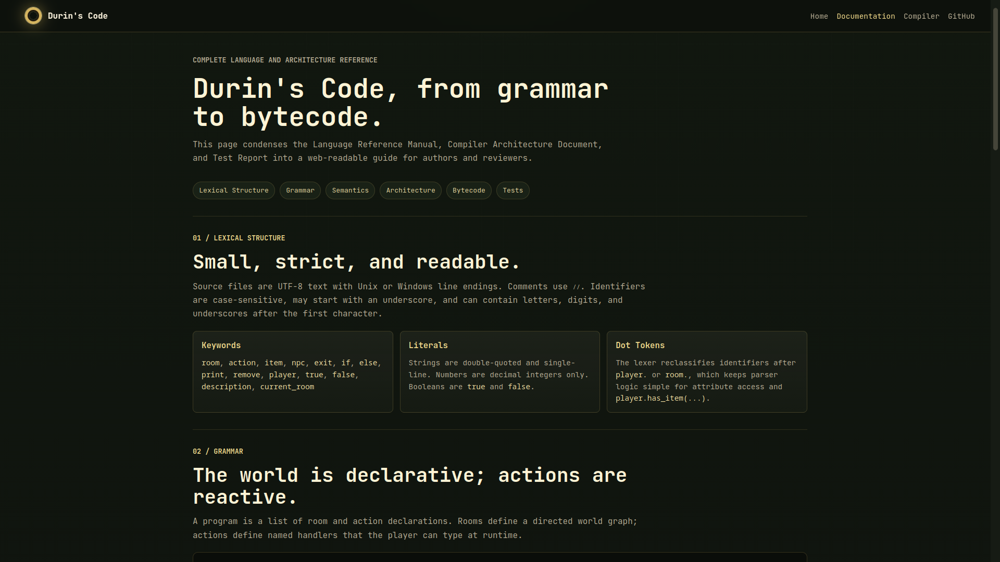
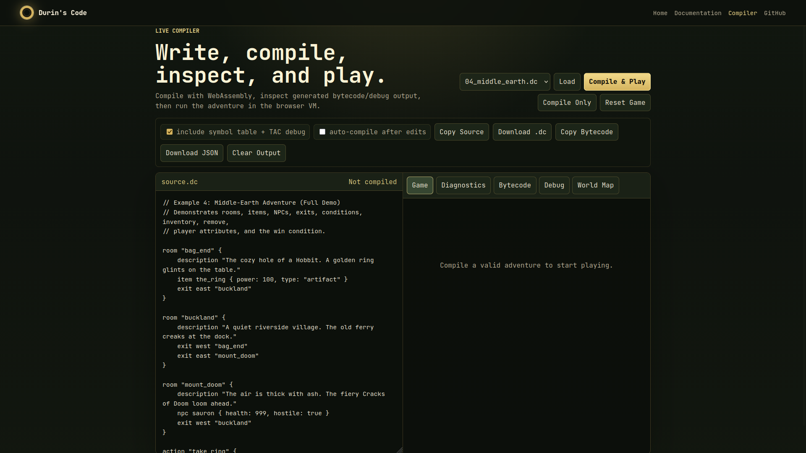

# Durin's Code

**A C++17 compiler and WebAssembly playground for building playable 8-bit text adventures.**

Durin's Code is a domain-specific language for authoring interactive fiction worlds. A `.dc` program describes rooms, items, NPCs, exits, and player actions; the compiler validates the world, lowers actions into Three-Address Code, emits JSON bytecode, and runs the result in a virtual machine.

The project includes both a terminal compiler/runtime and a browser showcase powered by WebAssembly.



## Table of Contents

- [What This Project Does](#what-this-project-does)
- [Language At A Glance](#language-at-a-glance)
- [Compiler Pipeline](#compiler-pipeline)
- [Architecture Highlights](#architecture-highlights)
- [Terminal CLI](#terminal-cli)
- [WebAssembly Playground](#webassembly-playground)
- [Documentation Page](#documentation-page)
- [Compiler Playground Features](#compiler-playground-features)
- [Examples](#examples)
- [Build And Run](#build-and-run)
- [Testing](#testing)
- [Project Structure](#project-structure)
- [Known Notes](#known-notes)

## What This Project Does

Durin's Code turns a declarative adventure script into a playable game.

The language lets authors define:

- **Rooms** as nodes in a world graph.
- **Items** with typed properties.
- **NPCs** with typed properties.
- **Exits** as directed edges between rooms.
- **Actions** as player-triggered command handlers.
- **Conditions** based on current room, inventory, and player attributes.
- **Runtime state** such as inventory, health, gold, reputation, or win state.

The compiler performs static checks before runtime, so invalid exits, duplicate declarations, and missing item references are caught early instead of crashing the game.

## Language At A Glance

```dc
room "bag_end" {
    description "The cozy hole of a Hobbit. A golden ring glints on the table."
    item the_ring { power: 100, type: "artifact" }
    exit east "buckland"
}

room "mount_doom" {
    description "The air is thick with ash. The fiery Cracks of Doom loom ahead."
    npc sauron { health: 999, hostile: true }
    exit west "buckland"
}

action "destroy ring" {
    if current_room == "mount_doom" && player.has_item(the_ring) {
        remove the_ring
        print "The ring is consumed by fire! Middle-earth is saved."
        player.win = true
    } else {
        print "You cannot do that here."
    }
}
```

Core language constructs:

| Construct                  | Purpose                                             |
| -------------------------- | --------------------------------------------------- |
| `room "name" { ... }`      | Declares a room in the adventure graph.             |
| `description "text"`       | Text shown when the player looks around.            |
| `item name { key: value }` | Places an item in a room and registers it globally. |
| `npc name { key: value }`  | Places an NPC in a room.                            |
| `exit direction "room"`    | Adds a directed transition to another room.         |
| `action "command" { ... }` | Defines a player command.                           |
| `print "text"`             | Writes narration to the VM output.                  |
| `remove item`              | Removes an item from inventory/game state.          |
| `player.inventory += item` | Adds an item to inventory.                          |
| `player.attr = value`      | Sets dynamic player state.                          |
| `if ... else ...`          | Branches action logic.                              |

## Compiler Pipeline

Durin's Code is implemented as a full multi-phase compiler, not just an interpreter.



### Phase Breakdown

| Phase             | Input         | Output                     | Responsibility                                                                    |
| ----------------- | ------------- | -------------------------- | --------------------------------------------------------------------------------- |
| Lexer             | Raw source    | Token stream               | Scans keywords, identifiers, literals, operators, comments, and line/column info. |
| Parser            | Tokens        | AST                        | Builds a typed AST using recursive descent.                                       |
| Semantic Analyser | AST           | Symbol table + diagnostics | Validates rooms, exits, actions, items, and references.                           |
| TAC Generator     | AST + symbols | Three-Address Code         | Lowers action logic into flat instructions.                                       |
| Optimiser         | Raw TAC       | Optimised TAC              | Applies dead-code elimination and redundant-AND folding.                          |
| Code Generator    | AST + TAC     | JSON bytecode              | Serialises the world graph and action instructions.                               |
| Virtual Machine   | Bytecode      | Playable session           | Maintains game state and executes player commands.                                |

## Architecture Highlights

### Lexer

- Pull-based scanner using `scanToken()`.
- Tracks line and column positions.
- Supports `//` comments.
- Rejects floating-point literals at lex time.
- Uses context-sensitive dot handling for `player.attr` and `room.attr`.

### Parser

- Hand-written recursive descent parser.
- Produces an owned AST using `std::unique_ptr`.
- Supports panic-mode recovery around declarations, statements, and block boundaries.

### Semantic Analysis

The analyser uses a two-pass design:

1. Register all top-level rooms, items, NPCs, and actions.
2. Validate references after every declaration is known.

This allows forward references such as an exit pointing to a room declared later.

Semantic checks include:

- Duplicate room names.
- Duplicate action names.
- Exit target does not exist.
- Duplicate exit directions inside one room.
- `remove` references an undeclared item.
- `player.has_item(...)` references an undeclared item.
- `current_room == "..."` references an undeclared room.

### TAC And Optimisation

Action bodies are lowered into TAC instructions such as:

- `CHECK_ROOM`
- `HAS_ITEM`
- `COMPARE_EQ`
- `JUMP_IF_FALSE`
- `JUMP`
- `LABEL`
- `PRINT`
- `REMOVE_ITEM`
- `SET_PLAYER_ATTR`

The optimiser currently performs:

- **Dead-code elimination** after unconditional jumps.
- **Redundant AND folding** when both operands are the same temporary.

### JSON Bytecode

The generated bytecode is the handoff point between compiler and VM.

```json
{
  "world": [
    {
      "name": "bag_end",
      "description": "The cozy hole of a Hobbit.",
      "items": [
        {
          "name": "the_ring",
          "properties": {
            "power": 100,
            "type": "artifact"
          }
        }
      ],
      "npcs": [],
      "exits": [
        {
          "direction": "east",
          "target": "buckland"
        }
      ]
    }
  ],
  "start_room": "bag_end",
  "actions": [
    {
      "name": "take ring",
      "instructions": []
    }
  ]
}
```

### Virtual Machine

The VM maintains:

- `currentRoom`
- `inventory`
- integer player attributes
- boolean player attributes
- string player attributes

Built-in commands:

- `look`
- `go <direction>`
- `inventory` / `inv`
- `help`
- `quit`

Any other input is matched against compiled action names.

## Terminal CLI

The native CLI is `durinsc`.

```bash
./durinsc <source.dc>
```

Compiles and immediately runs an adventure.

```bash
./durinsc <source.dc> -o <out.json>
```

Compiles source to JSON bytecode without launching the VM.

```bash
./durinsc --run <bytecode.json>
```

Runs precompiled bytecode directly.

```bash
./durinsc <source.dc> --debug
```

Prints compiler internals before running:

- symbol table
- optimised TAC

```bash
./durinsc --interactive
```

Starts a REPL-like mode where snippets can be compiled and run interactively.

## WebAssembly Playground

The project also includes a web showcase in `web/`.

It compiles the C++ compiler pipeline to WebAssembly using Emscripten, then runs bytecode in a TypeScript browser VM.



The web version intentionally does not port the terminal `runGameLoop()`. Instead, it keeps the existing C++ compiler as the source of truth and implements a browser-native VM for interactive play.

## Documentation Page

The web documentation page condenses the official digital documentation into a browser-friendly guide covering:

- lexical structure
- grammar
- declarations
- statements
- semantic rules
- compiler architecture
- bytecode shape
- VM runtime model
- testing coverage



## Compiler Playground Features

The browser compiler page supports:

- example picker
- source editor
- compile and play
- compile-only mode
- auto-compile after edits
- include/exclude symbol table and TAC debug output
- diagnostics panel
- bytecode JSON viewer
- debug/TAC viewer
- world map view
- copy source
- download `.dc`
- copy bytecode
- download bytecode JSON
- reset game
- playable command input



## Examples

The `examples/` directory contains:

| File                 | Purpose                                                  |
| -------------------- | -------------------------------------------------------- |
| `01_hello_world.dc`  | Minimal valid adventure with two rooms and one action.   |
| `02_inventory.dc`    | Demonstrates inventory add/remove and `player.has_item`. |
| `03_multiroom.dc`    | Demonstrates a connected multi-room world graph.         |
| `04_middle_earth.dc` | Full showcase adventure and recommended demo.            |
| `05_error_demo.dc`   | Intentionally broken semantic-error demo.                |

Recommended demo path for `04_middle_earth.dc`:

```text
take ring
go east
go east
destroy ring
```

## Build And Run

### Requirements

- CMake 3.23+
- C++17 compiler
- GoogleTest
- Node.js and npm for the web app
- Emscripten SDK for WebAssembly builds

### Native Compiler

```bash
cmake -S . -B build
cmake --build build
```

Run an example:

```bash
./build/durinsc examples/04_middle_earth.dc
```

Compile to bytecode:

```bash
./build/durinsc examples/02_inventory.dc -o inventory.json
```

Run bytecode:

```bash
./build/durinsc --run inventory.json
```

Debug compiler internals:

```bash
./build/durinsc examples/01_hello_world.dc --debug
```

### Web Playground

If Emscripten is installed but not loaded:

```bash
source ~/emsdk/emsdk_env.sh
```

Install and run:

```bash
cd web
npm install
npm run build:wasm
npm run dev
```

Open:

```text
http://localhost:5173/
```

Production build:

```bash
cd web
npm run build
npm run preview
```

## Testing

The project has 49 documented tests across six suites.

```bash
ctest --test-dir build --output-on-failure
```

Test coverage summary:

| Suite    | Tests | Covers                                                            |
| -------- | ----: | ----------------------------------------------------------------- |
| Lexer    |    12 | Keywords, punctuation, literals, comments, errors, line endings.  |
| Parser   |    15 | Rooms, items, NPCs, exits, conditions, assignments, error cases.  |
| Semantic |    10 | Symbol table, duplicate declarations, invalid references.         |
| TAC      |     4 | Print, conditions, assignments, remove instruction generation.    |
| Codegen  |     3 | Valid JSON, world serialisation, action instruction output.       |
| VM       |     5 | Bytecode loading, action execution, branching, inventory changes. |

## Project Structure

```text
DurinsCode/
├── src/
│   ├── lexer/        # tokenization
│   ├── parser/       # AST + recursive descent parser
│   ├── semantic/     # symbol table + static checks
│   ├── tac/          # TAC generation + optimiser
│   ├── codegen/      # JSON bytecode generation
│   ├── vm/           # native VM runtime
│   └── main.cpp      # CLI entry point
├── test/             # GoogleTest suites
├── examples/         # sample .dc programs
├── web/              # WebAssembly playground
├── Digital_Documentation/
│   ├── Language_Reference_Manual.pdf
│   ├── Compiler_Architecture_Document.pdf
│   ├── Test_Suite.pdf
│   ├── Team_Reflection.pdf
│   └── images/       # screenshots used in this README
└── third_party/
    └── nlohmann/json.hpp
```

## Known Notes

- Floating-point numbers are intentionally unsupported.
- The language is intentionally small and focused on text-adventure structure.
- `||` is lexed and parsed, but current showcased examples avoid relying on OR-heavy logic until TAC lowering is fully aligned.
- Browser compilation uses WebAssembly for the compiler and TypeScript for the web VM.

## Why This Project Matters

Durin's Code demonstrates the full compiler construction story in a compact but complete system:

- custom language design
- hand-written lexer
- recursive-descent parser
- typed AST
- two-pass semantic analysis
- symbol table construction
- intermediate representation
- optimisation passes
- JSON bytecode generation
- native virtual machine
- WebAssembly deployment
- browser-based compiler playground

It is small enough to understand end-to-end, but complete enough to show real compiler engineering.
