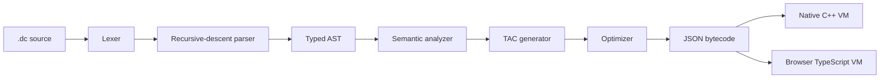

<div align="center">

# Durin's Code

### Write a world. Compile an adventure. Play it anywhere.

A C++17 compiler and WebAssembly playground for an 8-bit text-adventure language.

[](https://github.com/amh1k/DurinsCode/actions/workflows/deploy-pages.yml)


[Live Playground](https://abdulmoizhussain.me/DurinsCode/) · [Language Reference](Digital_Documentation/Language_Reference_Manual.pdf) · [Compiler Architecture](Digital_Documentation/Compiler_Architecture_Document.pdf) · [Report an Issue](https://github.com/amh1k/DurinsCode/issues)

</div>


## Overview

Durin's Code is a domain-specific language and end-to-end compiler for building playable text adventures. Authors describe rooms, items, NPCs, exits, conditions, and player actions in a compact `.dc` source file. The compiler validates the world, lowers action logic to Three-Address Code (TAC), optimizes it, emits portable JSON bytecode, and executes the result in a virtual machine.

The same compiler runs in two environments:

- **Native:** a C++ command-line compiler and interactive VM.
- **Browser:** the C++ compiler built to WebAssembly, paired with a TypeScript IDE and VM. Compilation and execution stay entirely client-side.

## Highlights

- Complete compiler toolchain: lexer, recursive-descent parser, typed AST, semantic analysis, TAC, optimization, code generation, and VM execution.
- Two-pass semantic analysis with forward-reference support and diagnostics for duplicate or unresolved declarations.
- JSON bytecode as a stable boundary between the compiler and native/browser runtimes.
- Browser IDE with examples, diagnostics, symbol-table and TAC inspection, bytecode output, world-map visualization, and interactive gameplay.
- 49 automated tests across six compiler and runtime suites.
- Static GitHub Pages deployment with no application server or server-side runtime.

## Language at a Glance

```dc
room "bag_end" {
    description "A golden ring glints on the table."
    item the_ring { power: 100, type: "artifact" }
    exit east "mount_doom"
}

room "mount_doom" {
    description "The fiery Cracks of Doom loom ahead."
    npc sauron { health: 999, hostile: true }
    exit west "bag_end"
}

action "take ring" {
    if current_room == "bag_end" {
        player.inventory += the_ring
        print "You take the One Ring."
    }
}

action "destroy ring" {
    if current_room == "mount_doom" && player.has_item(the_ring) {
        remove the_ring
        print "Middle-earth is saved."
        player.win = true
    } else {
        print "You cannot do that here."
    }
}
```

Language primitives include:

| Construct | Purpose |
| --- | --- |
| `room "name" { ... }` | Declare a room in the world graph. |
| `item name { ... }` | Place an item and define typed properties. |
| `npc name { ... }` | Place an NPC and define typed properties. |
| `exit direction "room"` | Create a directed room transition. |
| `action "command" { ... }` | Define a command the player can execute. |
| `if ... else ...` | Branch on room, inventory, or player state. |
| `player.inventory += item` | Add an item to the player's inventory. |
| `player.attribute = value` | Update dynamic integer, Boolean, or string state. |
| `print "text"` | Emit narration through the VM. |

See the [Language Reference Manual](Digital_Documentation/Language_Reference_Manual.pdf) for the complete grammar and semantic rules.

## Compiler Architecture



| Stage | Responsibility |
| --- | --- |
| Lexer | Scans keywords, identifiers, literals, operators, comments, and source positions. |
| Parser | Builds an owned AST with a hand-written recursive-descent parser and panic-mode recovery. |
| Semantic analyzer | Registers declarations, resolves forward references, and reports invalid world state. |
| TAC generator | Lowers action bodies into flat instructions such as `CHECK_ROOM`, `HAS_ITEM`, `JUMP_IF_FALSE`, and `SET_PLAYER_ATTR`. |
| Optimizer | Eliminates unreachable TAC after unconditional jumps and folds redundant Boolean operations. |
| Code generator | Serializes world data and executable actions into JSON bytecode. |
| Virtual machine | Manages rooms, inventory, attributes, movement, actions, output, and win state. |

More implementation detail is available in the [Compiler Architecture Document](Digital_Documentation/Compiler_Architecture_Document.pdf).

## Browser Playground

The browser app compiles the C++ frontend with Emscripten and loads it as WebAssembly. Valid source becomes JSON bytecode, which the TypeScript VM executes directly in the page. No source code or game state is sent to a backend.

<table>
  <tr>
    <td width="50%">
      
      <p align="center"><strong>Language and architecture documentation</strong></p>
    </td>
    <td width="50%">
      
      <p align="center"><strong>Compiler, diagnostics, bytecode, and game runtime</strong></p>
    </td>
  </tr>
</table>

The playground includes:

- Editable source and five bundled examples.
- Compile-and-play, compile-only, and optional auto-compile workflows.
- Structured diagnostics for lexical, syntax, and semantic errors.
- Symbol table, optimized TAC, JSON bytecode, and world-map views.
- In-browser commands, game output, inventory, and runtime state.
- Source and bytecode copy/download controls.

## Quick Start

### Run the Web App

Prerequisites: [Node.js](https://nodejs.org/) 18+, npm, and the [Emscripten SDK](https://emscripten.org/docs/getting_started/downloads.html) with `emcc` available on `PATH`.

```bash
git clone https://github.com/amh1k/DurinsCode.git
cd DurinsCode/web
npm ci
npm run build:wasm
npm run dev
```

Open the URL printed by Vite, normally `http://localhost:5173`.

For a production build:

```bash
cd web
npm run build
npm run preview
```

The deployable static site is written to `web/dist/`.

### Build the Native Compiler

Prerequisites: CMake 3.23+, a C++17 compiler, and GoogleTest.

```bash
git clone https://github.com/amh1k/DurinsCode.git
cd DurinsCode
cmake -S . -B build
cmake --build build
./build/durinsc examples/04_middle_earth.dc
```

Try the following commands in the game:

```text
take ring
go east
go east
destroy ring
```

## CLI Reference

```text
durinsc <source.dc>                 Compile and run a source file
durinsc <source.dc> -o <out.json>   Compile source to JSON bytecode
durinsc --run <bytecode.json>       Run precompiled bytecode
durinsc <source.dc> --debug         Print the symbol table and optimized TAC
durinsc --interactive               Start interactive compilation mode
```

The VM provides `look`, `go <direction>`, `inventory`/`inv`, `help`, and `quit`. Any other input is resolved against the actions compiled from the source program.

## Examples

| Example | Demonstrates |
| --- | --- |
| [`01_hello_world.dc`](examples/01_hello_world.dc) | Minimal world and action. |
| [`02_inventory.dc`](examples/02_inventory.dc) | Inventory mutation and `player.has_item`. |
| [`03_multiroom.dc`](examples/03_multiroom.dc) | A connected multi-room world graph. |
| [`04_middle_earth.dc`](examples/04_middle_earth.dc) | Full adventure with rooms, items, NPCs, conditions, and win state. |
| [`05_error_demo.dc`](examples/05_error_demo.dc) | Intentional semantic errors and compiler diagnostics. |

## Testing

Configure and build the native project, then run:

```bash
ctest --test-dir build --output-on-failure
```

The suite currently contains **49 passing tests**:

| Suite | Tests | Coverage |
| --- | ---: | --- |
| Lexer | 12 | Tokens, literals, comments, locations, line endings, and lexical errors. |
| Parser | 15 | Declarations, properties, actions, conditions, assignments, and recovery cases. |
| Semantic | 10 | Symbol registration, duplicates, unresolved references, and error collection. |
| TAC | 4 | Output, branching, assignment, and item-removal lowering. |
| Code generation | 3 | Valid JSON, world serialization, and action instructions. |
| VM | 5 | Bytecode loading, action dispatch, branching, and inventory state. |

The full test inventory and expected results are documented in the [Test Suite Report](Digital_Documentation/Test_Suite.pdf).

## Project Layout

```text
DurinsCode/
├── src/
│   ├── lexer/          # Tokenization and source diagnostics
│   ├── parser/         # AST and recursive-descent parser
│   ├── semantic/       # Symbol table and static validation
│   ├── tac/            # Intermediate code and optimization
│   ├── codegen/        # JSON bytecode generation
│   ├── vm/             # Native runtime
│   └── main.cpp        # CLI entry point
├── test/               # GoogleTest suites
├── examples/           # Sample .dc adventures
├── web/
│   ├── src/            # TypeScript IDE and browser VM
│   ├── wasm/           # C++/WebAssembly bindings
│   └── scripts/        # Emscripten build tooling
├── Digital_Documentation/
│   ├── Language_Reference_Manual.pdf
│   ├── Compiler_Architecture_Document.pdf
│   ├── Test_Suite.pdf
│   └── Team_Reflection.pdf
└── third_party/        # Vendored nlohmann/json header
```

## Design Notes

- Source files use integer, Boolean, and string literals; floating-point literals are intentionally rejected.
- Semantic analysis uses two passes so exits and conditions can reference rooms or items declared later.
- Browser compilation reuses the C++ compiler, while the browser runtime is implemented in TypeScript for DOM-friendly interaction.
- Logical OR (`||`) is recognized by the lexer and parser, but its TAC lowering is not yet complete. Avoid OR-dependent action logic until that pass is implemented.

## Documentation

- [Language Reference Manual](Digital_Documentation/Language_Reference_Manual.pdf)
- [Compiler Architecture Document](Digital_Documentation/Compiler_Architecture_Document.pdf)
- [Test Suite Report](Digital_Documentation/Test_Suite.pdf)
- [Team Reflection](Digital_Documentation/Team_Reflection.pdf)
- [Web Playground Setup](web/README.md)

## Maintainers

- Abdul Moiz Hussain
- Huzaifa Abdul Rehman
- Muhammad Abdullah Khan

---

<div align="center">
Built to make the full compiler pipeline visible, inspectable, and playable.
</div>
